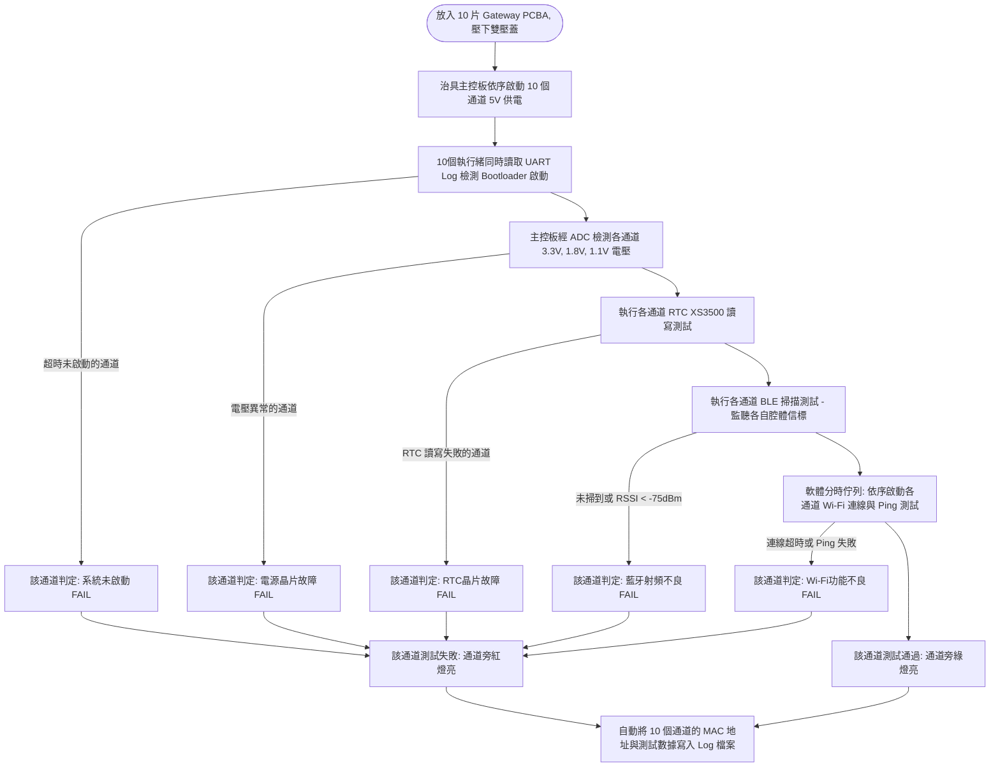

# MedFlow POSEIDON (滴護寶) Gateway 10連裝功能測試治具 (10-Channel FCT) 設計說明書

本文件為 **MedFlow 滴護寶 (POSEIDON) Gateway 閘道器主板**（基於 ITE IT9866 SoC + M8821CS1 模組之矩形 PCBA）之工廠量產段 **10通道並行功能測試治具 (10-Channel FCT Fixture)** 設計規格。本治具專用於 SMT 打件完成後，對主板的電源電軌、實時鐘 (RTC)、**藍牙 (BLE) 廣播接收** 與 **Wi-Fi AP 連線功能** 進行快速、多通道並行之自動化功能性檢驗。

---

## 1. 測試治具外觀與機械結構

治具採用手動鉸鏈壓合蓋板的電木針床結構，外觀示意如下：

### 1.1 機械與定位設計細節
* **10通道矩形矩陣佈局 (2x5 Grid Matrix Layout)**：
  * 因應 Gateway PCBA 為**矩形板子**（如 [S__24887304.jpg](file:///C:/Users/JOHN_WIESS/Downloads/S__24887304.jpg) 所示），治具下電木板共設有 10 個獨立的矩形精密定位凹槽（排成 2 排、每排 5 個槽）。
  * 每個測試槽內設有 4 支精密防呆定位銷，精準適配 Gateway 板子四角的定位螺絲孔，確保下壓時絕不偏位。
* **物理射頻屏蔽隔板 (RF Shielding Partition Walls)**：
  * 為防止 10 個通道在並行測試時，無線射頻（WiFi 與藍牙）發生同頻串擾，每個測試凹槽之間均銑有深槽並安裝**垂直金屬屏蔽鋁板**，將 10 個測試腔體物理隔離。
* **雙獨立透明壓蓋結構 (Dual Split Acrylic Lids)**：
  * 由於 10 通道探針總數較多（共 70 根彈簧針），若採用單一上蓋一次壓緊 10 片，需要極大的下壓力且操作不易。
  * 改採**雙獨立壓克力上蓋**設計，左右各覆蓋 5 個測試通道（1x5 矩陣），配有兩組獨立的手動連桿快速夾鉗（Lever Clamps）。
  * 壓蓋下方裝有防靜電橡膠緩衝壓塊，並使用透明壓克力，方便作業員觀察每片 Gateway 板載圓形螢幕的開機顯示狀態。

---

## 2. 測試接口與探針接腳定義

每個測試凹槽底部的針床配置 7 根彈簧探針，由下往上接觸 Gateway PCBA 底部的測試點（重點對準 U5 模組及主要電源路徑旁之測試點，如 TP7, TP8, TP10-13, TP18-20 等）：

| 探針編號 | 壓接測試點 (TP) | 治具端對接電路 | 測試檢驗功能 |
| :---: | :--- | :--- | :--- |
| **1** | `5V_IN` | 獨立 PMOS 可控 5V 供電電源 | 供給個別通道主板電源，可由軟體獨立重置與上電。 |
| **2** | `PGND` | 治具電源接地 (GND) | 系統共同參考地。 |
| **3** | `IT9866_TXD` | 治具板載 CH340N 的 **RXD** | 讀取 IT9866 UART 除錯輸出與測試 Log。 |
| **4** | `IT9866_RXD` | 治具板載 CH340N 的 **TXD** | 向 IT9866 發送測試指令與回傳結果。 |
| **5** | `+3.3V_SYS` | 16通道 ADC 輸入 (ADS1115 x2) | 檢測 PST9905 電源晶片輸出之 3.3V 電軌。 |
| **6** | `+1.8V_MEM` | 16通道 ADC 輸入 (ADS1115 x2) | 檢測 PST9905 電源晶片輸出之 1.8V 電軌。 |
| **7** | `+1.1V_CORE` | 16通道 ADC 輸入 (ADS1115 x2) | 檢測 PST9905 電源晶片輸出之 1.1V 電軌。 |

---

## 3. 功能測試原理與防止射頻干擾機制

治具的核心測試在於驗證 **M8821CS1** 晶片的無線射頻接收與連線功能是否正常。在 10 通道並行測試下，為避免無線信號互干擾，採取以下硬體與軟體雙重機制：

### 3.1 藍牙 (BLE) 廣播接收測試
* **硬體防串擾**：
  * 在 10 個測試槽的屏蔽小腔體內部，各裝設一個**超低功率的微型 BLE 信標 (Micro BLE Beacon)**。
  * 信標外殼貼有衰減吸波貼紙，將無線信號嚴格鎖定在各自的屏蔽腔內（信號溢出率 < -40dB）。
* **測試步驟**：
  * 主板通電開機後，測試電腦經由對應的 UART 連接埠，同時向 10 台 Gateway 發送「啟動藍牙掃描」指令。
  * 讀取接收數據，驗證是否成功收到各自槽內信標的特定 MAC 地址與廣播 Payload。
* **射頻強度 (RSSI) 判定標準**：
  * 接收到的信號強度 RSSI 應落在 **$-55\text{ dBm} \pm 5\text{ dB}$** 合格區間。
  * **若 RSSI < -75dBm**：判定為射頻引腳冷焊、PCB 天線匹配線路開路或天線端損壞 (FAIL)。
  * **若掃描不到**：判定為藍牙晶片無工作或通訊介面 (SDIO/UART) 故障 (FAIL)。

### 3.2 Wi-Fi AP 連線測試
* **軟體分時調度 (Time-sliced Scheduling)**：
  * 10 台設備若同時連接同一個測試 Wi-Fi AP (`MedFlow_Test_AP`)，會導致 DHCP 競爭與嚴重的同頻爭搶干擾，影響 Ping 響應時間的判斷。
  * **解決方案**：測試程式的軟體層採用**流水線佇列 (Queue/Pipeline)** 機制。雖然 10 台 Gateway 同步上電，但 Wi-Fi 連線與 Ping 測試採取**分時順序執行 (Time-sliced Serial Routing)**。每次僅允許 1~2 台設備發起連線與 Ping 封包，測試通過後隨即中斷連線，讓出通道給下一台。
* **測試步驟**：
  1. 測試程式經由 UART 命令指定通道的 Gateway 連接至指定的 `MedFlow_Test_AP`。
  2. 驗證 Gateway 是否能成功連接、取得有效 IP 地址。
  3. 連線成功後，命令 Gateway 向治具測試電腦 (`192.168.10.100`) 發送 **Ping (ICMP Echo Request)** 封包。
  4. 驗證是否在 2 秒內收到回包，以確認雙向網路資料傳輸無丟包，隨即中斷連線。

---

## 4. 電氣系統架構與自動化測試軟體流程

### 4.1 電氣系統架構 (Electrical Block Diagram)
* **大功率供電系統**：配置一組 5V/15A 直流開關電源，主板設有 10 組獨立的 PMOS 負載開關，可由治具主控板個別切換供電，並具備過流保護 (OCP) 電路，防止單板短路燒毀治具。
* **10埠 USB-UART 整合控制器**：板載集成一組 industrial 級 USB 2.0 HUB 晶片，分接出 10 路 CH340N USB-TTL 晶片，僅需一條 USB 傳輸線即可連接測試電腦，對應為 COM1 至 COM10。
* **多通道電壓檢測**：板載 2 片 8 通道高精度 ADC 晶片 (ADS1115)，由治具主控板 MCU (如 STM32) 透過 I2C 定期輪詢 10 台 Gateway 的電源電軌電壓，並將數據上報給電腦。

### 4.2 自動化測試軟體流程
測試電腦端的 Python 程式使用 `multiprocessing` 或 `asyncio` 同時讀取 10 個 COM 埠的 Log。流程如下：

### 4.3 測試判定標準
* **電軌電壓合格線**：
  * 3.3V 電軌：$3.3\text{V} \pm 0.15\text{V}$
  * 1.8V 電軌：$1.8\text{V} \pm 0.09\text{V}$
  * 1.1V 電軌：$1.1\text{V} \pm 0.05\text{V}$
* **藍牙 RSSI 標準**：$\ge -60\text{ dBm}$
* **Wi-Fi 連線與 Ping 響應**：$\le 3.0\text{ 秒}$
