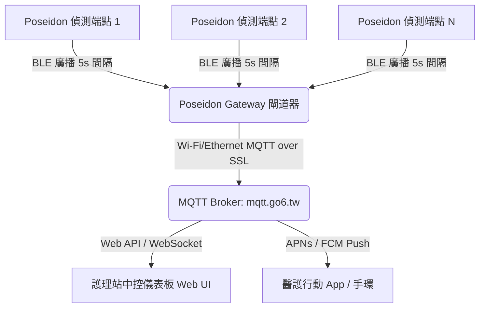

# MedFlow 滴護寶 - POSEIDON 系統設計與規格說明書

本文件詳細記錄 **滴護寶 (Smart IV Drip Monitor) POSEIDON** 系統之硬體規格、通訊協定、BLE 廣播封包格式以及 MQTT 閘道器配置資訊。

---

## 1. 系統架構與通訊拓撲

滴護寶系統採用二階式物聯網通訊架構：
1. **端點偵測器 (Poseidon Node)**：採用低功耗藍牙 (BLE) 技術，定期將液位偵測狀態以無連線廣播 (Broadcasting) 形式發出，以達到極低耗電、延長電池壽命之目的。
2. **護理站中控閘道器 (Poseidon Gateway)**：接收區域內所有偵測端點的 BLE 廣播封包，解析出液位狀態後，透過 Wi-Fi/乙太網路以 MQTT 協定上傳至後端伺服器與中控介面。



---

## 2. 偵測端點硬體規格 (Poseidon Node V2.0)

偵測端點掛載於點滴架上，藉由電容觸摸感測技術偵測點滴液面位置。

### 2.1 核心主控與外設晶片
* **主控 MCU**：炬芯科技 (Actions Semiconductor) **ATB1113 / AS3112 BLE SoC** (QFN32 封裝，BLE Module V1.3)。
  * 運行 Zephyr RTOS 與 BLE 協定棧。
* **觸控感測 IC (Touch IC)**：通泰 (Tontek) **BS211C / BS211C-1**。
  * 用於實現非侵入式液面偵測。

### 2.2 GPIO 引腳配置
* **GPIO18**：接收觸控晶片 (Touch IC) 的訊號輸出 (`0` 表示無液體，`1` 表示有液體)。
* **GPIO20**：狀態指示燈 (LED) 控制。開機後輸出為 `1` 時 LED 亮起。
* **GPIO12 / GPIO13**：系統韌體燒錄使用。

### 2.3 介面與電源管理
* **供電來源**：
  * 可使用 **CR2032 鈕扣電池** (+3V) 獨立供電。
  * 亦可透過外部電源插座 **J1** 連接外部供電 (採用 LIN2006M-204200R 4-Pin 金針連接器：引腳定義為 `+VBAT1`, `PGND`, `+VBAT2`, `KEY1/TPQ0`)。
* **除錯介面 (J2)**：提供預留 UART 接針 (未貼片，引腳定義為 `VCC`, `UART_TX`, `PGND`, `UART_RX`)。
* **靜電防護 (ESD Protection)**：
  * 外部供電接頭 J1 配置 **AZ4824-02S** TVS 防護晶片。
  * UART 除錯接頭 J2 配置 **TVS_AZ4836-01L** TVS 防護晶片。

---

## 3. BLE 廣播協定格式 (Broadcasting Payload)

偵測端點無須與閘道器建立藍牙連線，直接以不可連線廣播模式發送設備資訊與感測狀態。

### 3.1 廣播參數
* **廣播間隔 (Adv Interval)**：1.5s (`APP_ADV_INTERVAL`) - 平衡功耗與感測即時性
* **廣播持續時間**：無限 (`BLE_GAP_ADV_TIMEOUT_GENERAL_UNLIMITED`)
* **廣播模式**：`BLE_ADV_MODE_FAST`
* **PDU 類型**：`ADV_NONCONN_IND` (不可連線、不可掃描廣播，大幅降低晶片接收功耗)
* **Preamble**：1 byte (`0xAA`)
* **Access Address**：4 bytes (`0x8E89BED6`)
* **Payload 長度**：17 bytes (`0x11`) - 符合 BLE 31 類型的廣播封包限制

### 3.2 廣播數據欄位分解 (Payload Fields)

廣播封包由兩個標準 AD Structure 組成：

| 欄位順序 | 欄位名稱 | 長度 (Byte) | 類型 (Type) | 數值 (Value) | 說明 |
| :---: | :---: | :---: | :---: | :---: | :--- |
| **-** | **AD1 Structure (Flags)** | | | | |
| 1 | AD1 Length | 1 | - | `0x02` | 後續欄位長度 |
| 2 | AD1 Type | 1 | - | `0x01` | Type: Flags |
| 3 | AD1 Value | 1 | - | `0x06` | LE General Discoverable, BR/EDR Not Supported |
| **-** | **AD2 Structure (Manufacturer Specific Data)** | | | | |
| 4 | AD2 Length | 1 | - | `0x0C` (12) | 後續欄位長度 |
| 5 | AD2 Type | 1 | - | `0xFF` | Type: Manufacturer Specific Data |
| 6-7 | Company ID | 2 | - | `0xFAFA` | 暫定廠商識別碼 (Company ID) |
| 8 | Product ID | 1 | - | `0x01` | 產品代號（`0x01` 代表 MedFlo 滴護寶） |
| 9-14 | MAC Address | 6 | - | `0xXX..XX` | 設備實體 MAC 地址（利於 iOS App 讀取） |
| 15 | Status Byte | 1 | - | `0xXX` | **設備狀態位元組**（定義詳見 3.3） |
| 16 | Rolling Counter | 1 | - | `0xXX` | 滾動流水號 (0~255)，每次廣播狀態變更或定時遞增，便於過濾重複包 |
| 17 | Checksum | 1 | - | `0xXX` | 簡單校驗和 (XOR Checksum)，用於確保數據完整性 |

### 3.3 設備狀態位元組 (Status Byte) 定義

Status Byte 採用位元欄位 (Bit-field) 設計，完整容納現有 Touch IC 狀態與未來尿袋流量感測器數據：

| Bit 區間 | 欄位名稱 | 數值範圍 | 說明 |
| :---: | :--- | :---: | :--- |
| **Bit 0** | GPIO 18 狀態 (Touch IC) | `0` ~ `1` | `0`: 空 (Empty / 液位低於警戒線)<br>`1`: 滿 (Full / 液位正常) |
| **Bit 1 - 5** | 尿液流量階數 (Urine Flow) | `0` ~ `20` | `0`: 未連接 / 未啟用<br>`1` ~ `20`: 代表 1 到 20 階流量 (5 bits 最大支援至 31 階) |
| **Bit 6** | 低電量警報 (Battery Low) | `0` ~ `1` | `0`: 電量正常<br>`1`: 鈕扣電池電量過低，需更換 |
| **Bit 7** | 系統狀態 (Sys Error) | `0` ~ `1` | `0`: 正常運作<br>`1`: 設備異常 / 感測器失效 |

#### Status Byte 數值範例：
* 若點滴液位正常 (GPIO 18 = 1)，尿袋流量未啟用 (0)，電量正常 (0)，系統正常 (0)：
  二進制為 `0b00000001` = `0x01`。
* 若點滴液位正常 (GPIO 18 = 1)，尿袋流量偵測中且為第 15 階 (`01111`)，電量正常 (0)，系統正常 (0)：
  二進制為 `0b00011111` = `0x1F`。
* 若點滴用罄 (GPIO 18 = 0)，電量過低 (Bit 6 = 1)：
  二進制為 `0b01000000` = `0x40`。

---

## 4. 閘道器硬體規格 (Poseidon Gateway V1.0)

* **設計與硬體資料路徑**：[C:/公司/Design/睿建滴護寶/GW](file:///C:/公司/Design/睿建滴護寶/GW)

閘道器安裝於病房牆面或護理站，作為 BLE 與網際網路的雙向橋樑。

### 4.1 核心元件
* **主控處理器 (SoC)**：聯陽半導體 (ITE) **IT9866 / IT9868** 高整合型雙核心處理器。
* **Wi-Fi / 藍牙模組**：正基科技 **BL-M8821CS1** 雙模模組 (基於 Realtek M8821CS1 晶片，使用 SDIO 介面與主控通訊)。
* **外部儲存 Flash**：**GD25Q128ESIGR** (128M-bit / 16MB SPI Flash)。
* **實時鐘 (RTC)**：外掛 **XS3500** 高精度 RTC 晶片。
* **本機顯示器**：4 吋 RGB666 圓形/方形面板，採用 **ST7701S** 顯示驅動晶片與 HSD 3.95/4.0 吋屏幕。

### 4.2 電源與指示燈
* **電源輸入**：5V USB-C 供電輸入。
* **電源排序控制**：採用 **PST9905** 電源管理晶片，自動管理並輸出核心所需的 `1.1V`, `1.8V`, `3.3V` 電壓排序。
* **本機狀態指示燈**：
  * **BT Status LED** (綠/橘雙色)：指示藍牙掃描工作狀態。
  * **Wi-Fi Status LED**：指示 Wi-Fi 伺服器連線狀態。

---

## 5. MQTT 通訊規格與資料格式

閘道器解析 BLE 廣播後，將封包整理成 JSON 格式並上傳。

### 5.1 MQTT Broker 連線設定
* **伺服器網址**：`mqtt.go6.tw`
* **連線埠 (Port)**：
  * `8883` (SSL 加密傳輸 - 推薦生產環境使用)
  * `1883` (TCP 明文傳輸 - 僅供測試)
  * `8083` (Websocket over SSL - 前端中控連線使用)
* **發佈 (Publish/Write) 帳密與主題**：
  * **帳號**：`DCareW`
  * **密碼**：`4rfghy6`
  * **發佈主題 (Topic)**：`DCare/d/<gwid>` (其中 `<gwid>` 為閘道器 16 碼識別碼)
* **訂閱 (Subscribe/Read) 帳密與主題**：
  * **帳號**：`DCareR`
  * **密碼**：`6yhgvfr4`
  * **訂閱主題 (Topic)**：`DCare/d/#` (可訂閱接收所有閘道器的上報資料)

### 5.2 線上測試網址 (測試調試用)
* **測試發佈端 (Write) 網址**：[Noonspace MQTT Write Tool](https://mqtt.noonspace.com/mainssl/modules/MySpace/index.php?sn=mqtt&pg=ZC4876)
* **測試收訊端 (Read) 網址**：[Noonspace MQTT Read Tool](https://mqtt.noonspace.com/mainssl/modules/MySpace/index.php?sn=mqtt&pg=ZC4854)

### 5.3 閘道器上報 JSON 資料格式
閘道器會定期將掃描到的端點遙測資料包裝成 JSON 陣列發送：

```json
[
  {
    "channel": 924000000,
    "sf": 10,
    "time": "2026-06-21T13:12:00+08:00",
    "gwip": "192.168.0.19",
    "gwid": "00005813d34aed65",
    "repeater": "00000000ffffffff",
    "systype": 161,
    "rssi": -33,
    "snr": 23,
    "snr_max": 33.8,
    "snr_min": 20,
    "macAddr": "00000000a1001176",
    "data": "0000081f",
    "frameCnt": 8,
    "fport": 3
  }
]
```

#### 欄位定義說明
* **channel**：通訊頻道頻率 (Hz)。
* **sf**：擴頻因子 (Spreading Factor)。
* **time**：封包生成之 RFC3339 時間戳記。
* **gwip**：閘道器取得之區域網路 IP 位址。
* **gwid**：閘道器的 16 碼唯一硬體識別碼 (MAC 延伸而來)。
* **repeater**：中繼器識別碼，預設為 `00000000ffffffff`。
* **systype**：系統類型代碼，固定為 `161` (代表滴護寶健康照護系統)。
* **rssi**：接收信號強度指示 (dBm)。
* **snr**：信號雜訊比 (dB)。
* **macAddr**：**偵測端點 (Node) 的 16 碼硬體識別碼** (前端為 `00000000` + 8 碼藍牙 MAC 位址)。
* **data**：**端點上報之感測狀態數據 (HEX 格式，固定 8 字符 / 4 Bytes)**：
  * **Byte 0-1 (最高位兩個位元組)**：預留，固定為 `0000`
  * **Byte 2 (第三個位元組)**：對應藍牙廣播 Payload 中的 **Rolling Counter**（例如：`08`）
  * **Byte 3 (最低位位元組)**：對應藍牙廣播 Payload 中的 **Status Byte**（例如：`1F` 代表點滴液位正常且尿液流量為第 15 階）
  * *解析例*：`"0000081f"` 表示封包序號為 8，狀態代碼為 `0x1F`。
* **frameCnt**：滾動訊框計數器，用於確認防重送與丟包。可直接映射藍牙廣播中的 Rolling Counter。
* **fport**：應用邏輯埠，預設為 `3`。
