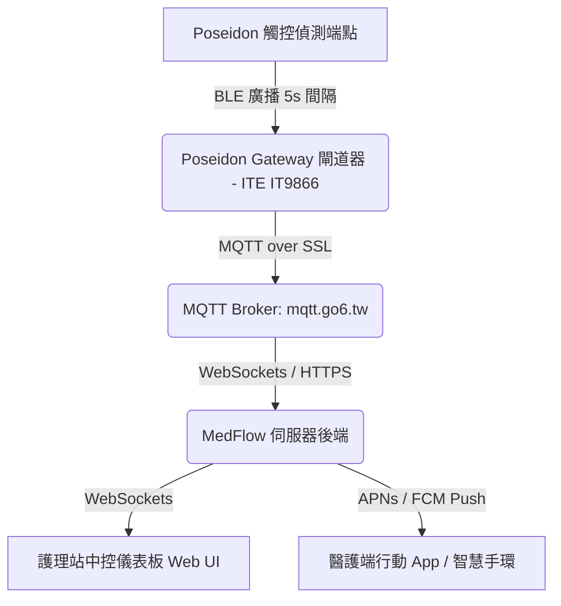

# MedFlow 智慧醫療物聯網產品系列

MedFlow 是一套專為醫療機構與照護中心設計的**智慧醫療物聯網產品系列 (Smart Healthcare IoT Product Family)**。透過非侵入式的感測技術與藍牙物聯網架構，即時監控患者輸液與排泄狀態，降低醫護負擔。

詳細產品介紹請參閱：[Docs/Product_Introduction.md](file:///c:/Users/JOHN_WIESS/.gemini/antigravity-ide/scratch/MedFlow/Docs/Product_Introduction.md)

---

## 1. 產品線與最新進度

1. **液面感測 (滴護寶 - Smart IV Drip Monitor)**
   * **產品代號**：藍牙端點代號為 **POSEIDON** (代表 BT)，閘道器為 **Gateway** (或 Poseidon Gateway)
   * **系統組成**：a. 單點電容觸控貼片, b. BLE藍牙廣播, c. 藍牙轉Wi-Fi閘道器, d. 雲端伺服器
   * **最新進度**：設計接近完成 (硬體電路 Layout 與 MQTT 連接協議對接已就緒)
2. **尿袋 IO (Smart Urine Bag Monitor)**
   * **系統組成**：a. 多點電容觸控貼片, b. BLE藍牙廣播, c. 藍牙轉Wi-Fi閘道器, d. 雲端伺服器
   * **最新進度**：初期規劃 (架構定義與多點電容貼片驗證)

---

## 2. 滴護寶系統架構簡介

滴護寶系統主要由三大核心區塊構成：

* **端點裝置 (Poseidon Node)**：掛載於點滴架上，藉由 Tontek BS211C-1 電容式觸控感測技術，非侵入式地偵測點滴液位是否低於警戒線，並以 BLE 廣播形式發送狀態。
* **閘道器 (Poseidon Gateway)**：採用 ITE IT9866 高整合處理器，整合藍牙掃描與 Wi-Fi/乙太網路功能。負責接收並解析區域內所有點滴偵測端點的廣播封包，將狀態經由 MQTT 安全協定上報至伺服器。
* **軟體系統 (Dashboard & App)**：即時呈現各床位點滴液位狀態，並在「點滴用罄」或「斷線異常」時發出即時警報，通知負責護理師。

---

## 2. 專案目錄結構

本專案採模組化設計，結構如下：

* [Hardware/](file:///c:/Users/JOHN_WIESS/.gemini/antigravity-ide/scratch/MedFlow/Hardware/)：硬體電路圖、Layout、BOM 表與硬體測試手冊。
* [Firmware/](file:///c:/Users/JOHN_WIESS/.gemini/antigravity-ide/scratch/MedFlow/Firmware/)：MCU 主控程式碼（感測驅動、低功耗管理、無線網路協議）。
* [Software/](file:///c:/Users/JOHN_WIESS/.gemini/antigravity-ide/scratch/MedFlow/Software/)：後端 API 服務、護理站儀表板 UI 以及通訊服務（MQTT Broker）。
* [Docs/](file:///c:/Users/JOHN_WIESS/.gemini/antigravity-ide/scratch/MedFlow/Docs/)：產品規格書、系統架構說明與本機設計規範。
  * [Docs/System_Architecture.md](file:///c:/Users/JOHN_WIESS/.gemini/antigravity-ide/scratch/MedFlow/Docs/System_Architecture.md) - 系統架構簡介與數據流說明。
  * [Docs/Poseidon_Design_Specs.md](file:///c:/Users/JOHN_WIESS/.gemini/antigravity-ide/scratch/MedFlow/Docs/Poseidon_Design_Specs.md) - 產品詳細設計與通訊規格書（包含硬體接腳、藍牙 PDU、MQTT JSON 格式）。
  * [Docs/Gateway_Connection_Info.md](file:///c:/Users/JOHN_WIESS/.gemini/antigravity-ide/scratch/MedFlow/Docs/Gateway_Connection_Info.md) - 閘道器連線設定、測試 URL 與上報 JSON 資料規格。
  * [Docs/Gateway_Functional_Specs.md](file:///c:/Users/JOHN_WIESS/.gemini/antigravity-ide/scratch/MedFlow/Docs/Gateway_Functional_Specs.md) - 閘道器功能設計概念書（包含 USB 通訊、Windows App、OTA、時間同步）。
  * [Docs/Urine_Bag_Monitor_Specs.md](file:///c:/Users/JOHN_WIESS/.gemini/antigravity-ide/scratch/MedFlow/Docs/Urine_Bag_Monitor_Specs.md) - 尿袋監測器設計規格、GPIO 配置與操作 SOP 說明。

---

## 3. 開發規格與主要元件

### 端點裝置端 (Poseidon Node V2.0)
* **主控 MCU**：炬芯科技 (Actions Semiconductor) **ATB1113 / AS3112 BLE SoC** (QFN32)。
* **感測技術**：電容觸控非侵入式液面偵測，採用通泰 **BS211C / BS211C-1** 觸控 IC，靈敏度高且不接觸藥液。
* **電源管理**：支援單個 CR2032 鈕扣電池供電，搭配高效率 LDO 與 Zephyr tickless 省電策略，續航力可達數月以上。

### 閘道器端 (Poseidon Gateway V1.0)
* **主控處理器**：聯陽半導體 (ITE) **IT9866 / IT9868** 晶片。
* **網路通訊**：正基科技 **BL-M8821CS1** Wi-Fi + BLE 雙模模組（使用 SDIO 介面）。
* **實時顯示**：配備 4 吋圓形/方形 RGB 螢幕，採用 **ST7701S** 顯示驅動。
* **本機閘道器設計資料**：[C:/公司/Design/睿建滴護寶/GW](file:///C:/公司/Design/睿建滴護寶/GW)
* **本機閘道器原始碼路徑 (開發基礎)**：[C:/公司/Design/睿建滴護寶/GW/source code/ITE9868_Build_20260703](file:///C:/公司/Design/睿建滴護寶/GW/source code/ITE9868_Build_20260703)

### 軟體與通訊端 (Software)
* **通訊協定**：MQTT over SSL（伺服器 `mqtt.go6.tw`，預設加密連接埠為 `8883`）。
* **前端技術**：護理站中控台採用 Modern Web 技術（React / Vue 結合 Tailwind CSS），支援響應式排版與 Websocket 即時通知。
* **後端技術**：Node.js (TypeScript) 或 Go，並使用 Redis 處理即時設備狀態與在線監控快取。
